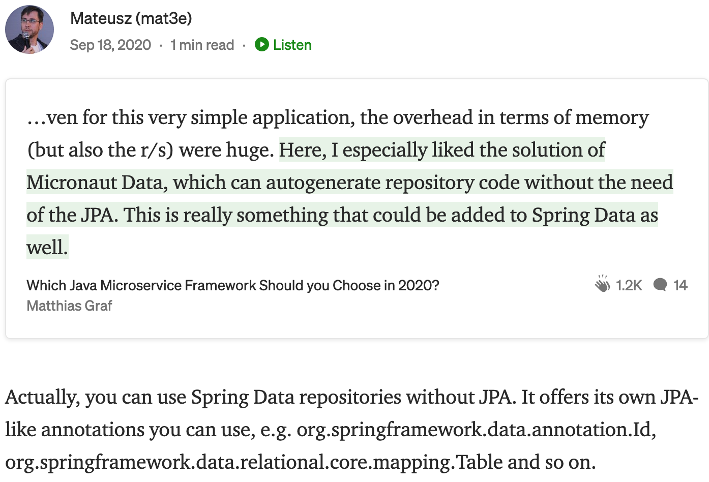

# Less popular Spring tricks: no Hibernate, rest repo, projections

Typical Spring project

* JPA (usually Hibernate ORM), `@Entity` classes here and there, Flyway for DB migrations
* Spring Data - SQL for above classes; especially `JpaRepository`
* Entity-DTO mapping, usually done by hand
* `@Controller` or `@RestController` exposing DTOs

This project

* Still with Flyway
* Still with Spring Data
* No JPA, no "manual" mappings, fancy REST (HATEOAS)

## Example code

Perfect catalog-like CRUD application. The main (and only) entity is called `Category` and thanks
to [carwarninglights.net](https://carwarninglights.net/car-guide/car-segments/) I made it displaying car segments.

From the first view it looks typical - there is a file-based H2 SQL database, it can be started easily and
with `src/main/resources/Less popular Spring tricks.postman_collection.json` anyone can
use [Postman](https://www.postman.com/) to check it in action.

However, code itself can be a little confusing. There is no JPA, no Spring Data JPA dependency, you cannot extend a
typical `JpaRepository`. There are way more interfaces than classes and a familiarly looking `TraditionalController`
doesn't seem to be used much. And git commits show it was built like that from the very beginning!

## No Hibernate

Do you know we don't need Hibernate to use `@Table` annotation?

[](https://betterprogramming.pub/which-java-microservice-framework-should-you-choose-in-2020-4e306a478e58)

### [Spring Data JDBC](https://spring.io/projects/spring-data-jdbc)

`org.springframework.data.annotation` and `org.springframework.data.relational.core.mapping` to the rescue!

[Detailed documentation](https://docs.spring.io/spring-data/jdbc/docs/current/reference/html/#reference).

## Rest Repo

[Spring Data REST](https://spring.io/projects/spring-data-rest) specifically. With
its [detailed documentation](https://docs.spring.io/spring-data/rest/docs/current/reference/html/#reference).

## Projections

Not only
for [above repositories](https://docs.spring.io/spring-data/rest/docs/current/reference/html/#projections-excerpts), but
also with a more "traditional" approach:

```java
//                                                 👇
interface CategoryRepository extends Repository<Category, Long> {

    //        👇
    List<TextCategoryVM> findTextualCategoriesBy();
}

@Getter
@NoArgsConstructor(access = PROTECTED)
@Table("categories")
class Category {

    @Id
    private Long id;
    @NotBlank
    private String code;
    @NotBlank
    private String name;
    private String description;
    private String imageUrl;
    @Column("is_deprecated")
    private boolean deprecated;
}

// getters "compatible" with the Category class
interface TextCategoryVM {

    String getCode();

    String getName();

    String getDescription();
}
```

Further read:

* Baeldung: [Spring Data JPA Projections](https://www.baeldung.com/spring-data-jpa-projections)
* [Generic `findBy(Class<T> type)` projection](https://stackoverflow.com/questions/48441324/spring-data-jpa-generic-projection-findall)
